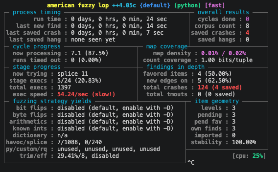
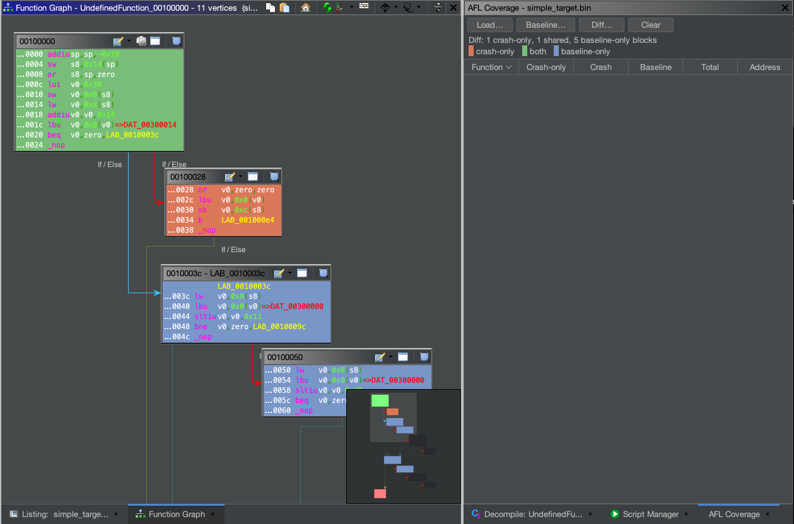

<h1 align="center">ghidra-aflcov</h1>

<p align="center">
  <a href="https://github.com/sengi12/ghidra-aflcov/actions/workflows/build.yml"></a>
</p>

<p align="center">
  <strong>Fuzzing coverage, painted onto Ghidra.</strong><br>
  Load a drcov file and see exactly which basic blocks a run reached —
  highlighted in the Listing and the Function Graph.
</p>

<p align="center">
  
</p>

<p align="center">
  <sub>See my version of afl-unicorn<br>
</p>

<p align="center">
  
</p>


`ghidra-aflcov` is the Ghidra counterpart to the block-highlighting coverage view
that afl-unicorn users know from Lighthouse in IDA. It reads a
[drcov](https://dynamorio.org/page_drcov.html) coverage file — the same format
DynamoRIO, Lighthouse and Dragondance use — maps the executed blocks onto the
open program, and colours them so the code paths a fuzzing run took are visible
at a glance. It runs wherever Ghidra runs, macOS ARM included.

This plugin only *displays* coverage. Producing the drcov file is the job of the
collector in the companion [afl-unicorn](https://github.com/sengi12/afl-unicorn)
fork, whose Unicorn harness records every executed block during emulation.

## What it does

- **Load drcov** — parse a coverage file and paint the covered basic blocks.
- **Block highlighting** — colours snap to Ghidra's own basic blocks, so whole
  nodes light up in the Function Graph, not just byte ranges in the Listing.
- **Function table** — every function the run touched, ranked by the share of its
  blocks that executed. Double-click a row to jump there.
- **Clear** — remove the colouring in one click.

## Requirements

- Ghidra 11.3.2 or 12.1.3 (both need JDK 21); CI compiles against both on every push.
- A drcov coverage file (from the afl-unicorn collector, or any drcov producer).

## Installation

1. Clone this repository.
2. Open Ghidra and open the program you fuzzed.
3. Add this directory to the Script Manager's script directories:
   1. Click the **green play button** in the toolbar (Script Manager).
   2. Click **Manage Script Directories** (the icon at the top right).
   3. Click the green **+** and add the `ghidra-aflcov` directory.
4. Filter the Script Manager for `AflCoverage.java`, select it, and click run
   (or use the `Alt-A` key binding). A docked **AFL Coverage** window appears.
5. In that window, click **Load drcov…** and pick your coverage file.

## How addresses line up

drcov stores each block as an offset from its module's base, which keeps coverage
independent of where the module happened to load. The plugin rebases those
offsets onto the open program's image base, so as long as you point it at the
same binary you fuzzed, the blocks land in the right place. When a coverage file
contains several modules, the one whose name matches the open program is chosen
(falling back to the module with the most blocks).

## Updating

If Ghidra is already open when you pull changes, quit it and run
`python3 cleanup.py` before relaunching — a running Ghidra keeps using the script
bundle it first compiled. See `cleanup.py --help` for options.

## Layout

```
AflCoverage.java              entry point (a GhidraScript); wires up the UI
resources/
  GhidraSrc.java              shared GhidraScript base
  AflCoverageProvider.java    the dockable window
  CoveragePanel.java          toolbar + function table
  CoverageActions.java        panel → entry-script callbacks
  DrcovParser.java            drcov file reader
  Coverage.java               parsed model (modules + blocks)
  CoveragePainter.java        rebase, snap to basic blocks, colour
cleanup.py                    clear Ghidra's compiled-bundle cache
```

The plugin follows the GhidraScript-style layout of
[cantordust](https://github.com/sengi12/cantordust) and
[ghidra-hexEditor](https://github.com/sengi12/ghidra-hexEditor): a thin entry
class that extends `GhidraScript`, with the real work in ordinary classes under
`resources/`.

## License

Apache License 2.0. See [LICENSE](./LICENSE).
